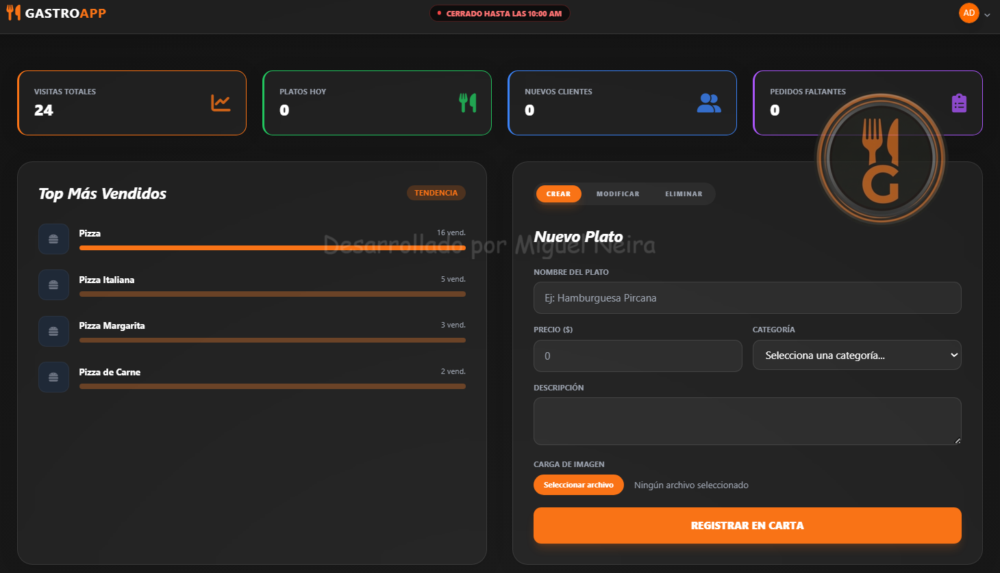
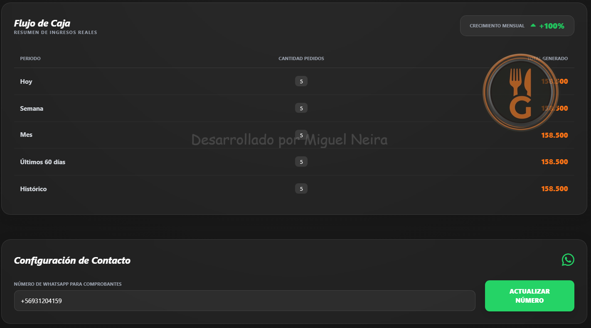
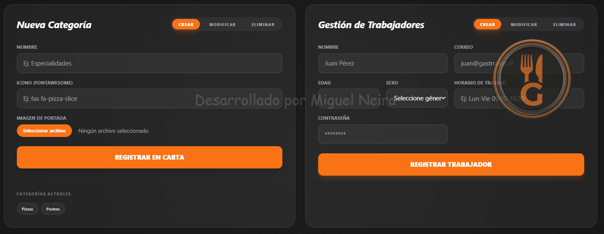
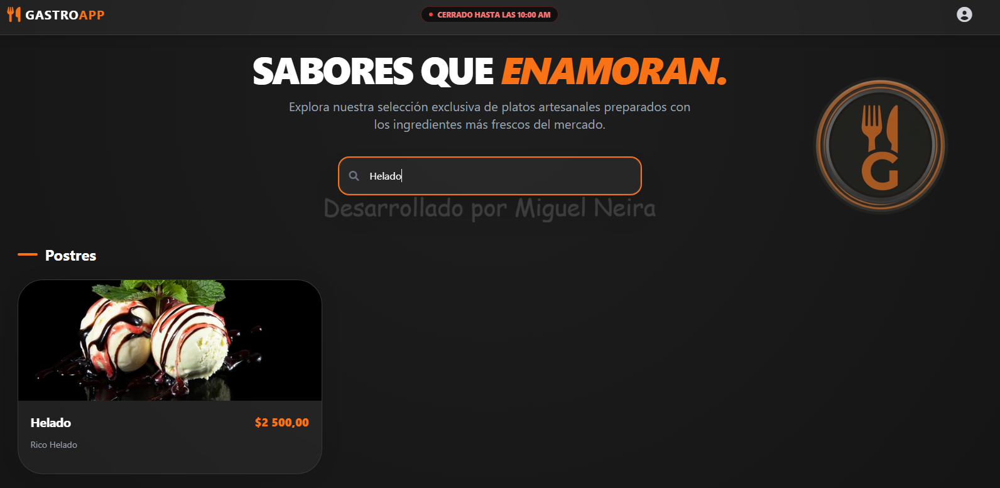
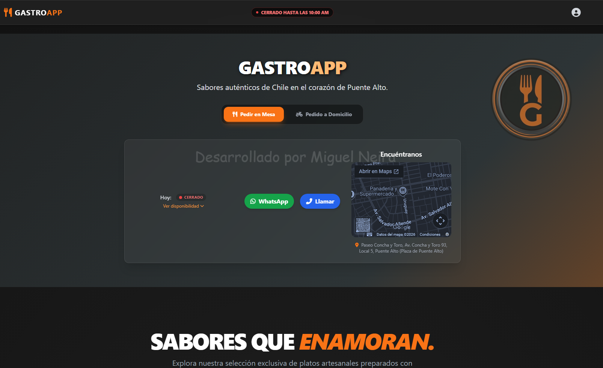
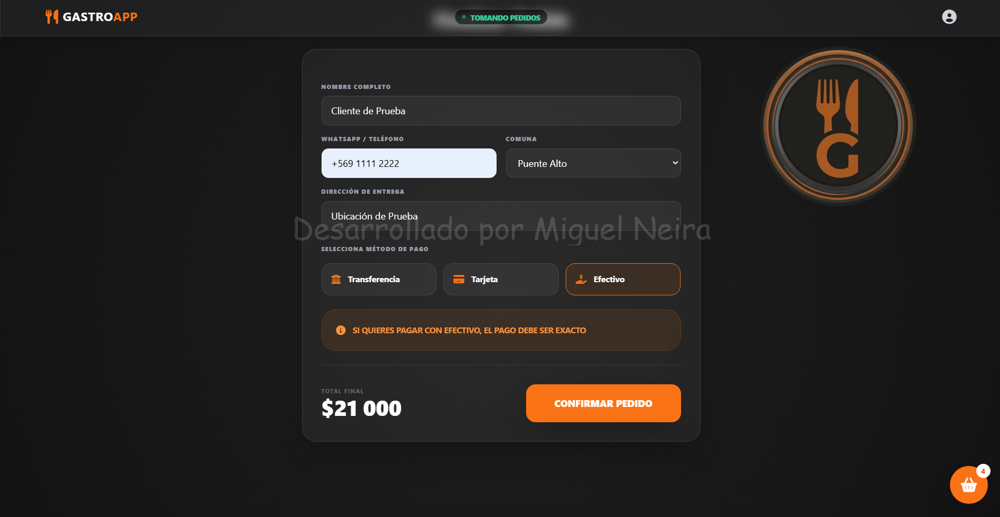
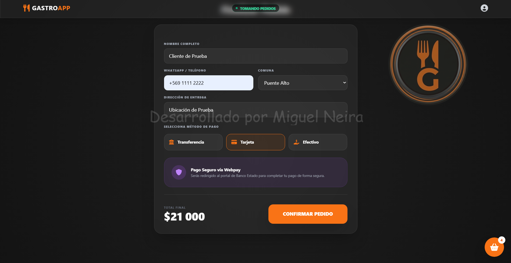
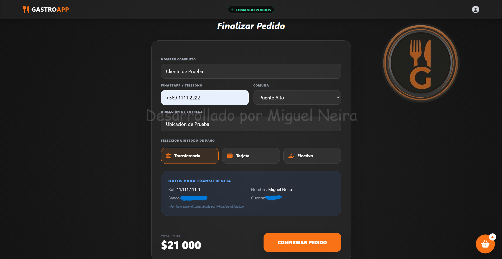
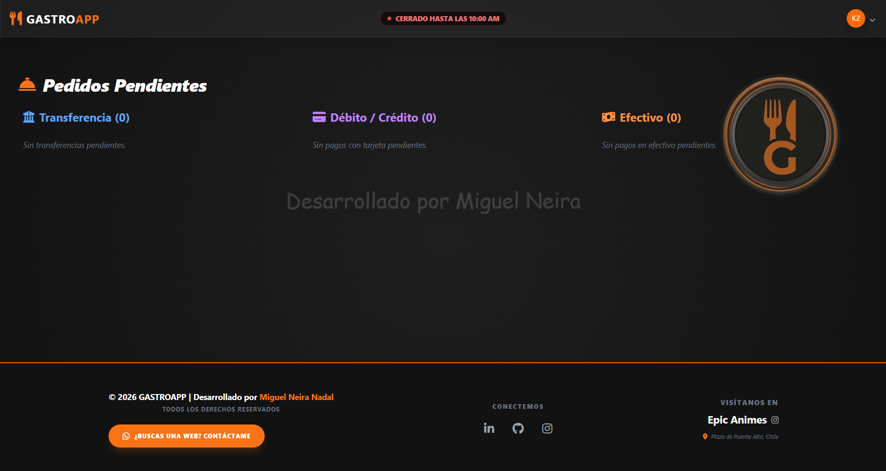
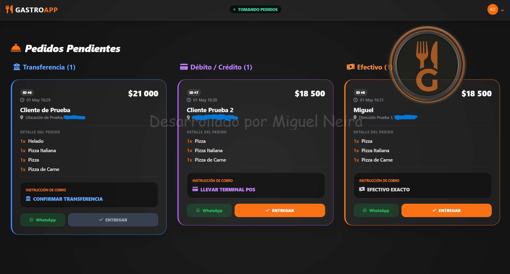

# 🍽️ GASTROAPP - Gestión Gastronómica Inteligente

**GastroApp** es una solución **Full Stack** de alto rendimiento diseñada para digitalizar y optimizar la operación integral de restaurantes. Este proyecto demuestra la implementación de arquitecturas modernas, seguridad de grado industrial y una experiencia de usuario (UX) centrada en la eficiencia operativa.

> [!IMPORTANT]
> **Código Fuente Privado:** Este repositorio constituye una galería técnica de portafolio. El acceso al código base está restringido por derechos de propiedad intelectual y fines de explotación comercial.

---

## 🛠️ Especificaciones Técnicas

Como Ingeniero en Informática, el desarrollo se rigió bajo estándares internacionales de escalabilidad y mantenibilidad:

*   **Backend Robusto:** Lógica de negocio avanzada implementada con **Python** y el framework **Django**, gestionando flujos complejos de pedidos, estados de cocina y transacciones financieras.
*   **Interfaz Dinámica (PWA Ready):** Frontend responsivo desarrollado con **Tailwind CSS** y **JavaScript**, optimizado tanto para dispositivos móviles de clientes como para terminales de punto de venta (POS).
*   **Seguridad Multicapa:** Sistema de autenticación con protección de datos, middlewares de seguridad y validaciones de sesión basadas en estándares de la industria.
*   **Arquitectura de Datos:** Diseño de base de datos relacional (**PostgreSQL/SQLite**) optimizado para consultas de reportes financieros y gestión de inventario en tiempo real.

---

## 🖼️ Galería del Proyecto

A continuación, se detallan los módulos principales del sistema. *Haz clic en cada sección para desplegar las capturas de pantalla.*

📊 <b>Panel de Administración y Métricas</b>

 
Control centralizado para la toma de decisiones basada en datos, incluyendo gestión CRUD de menús y analítica de ventas.

| Dashboard Estadístico | Flujo de Caja (V2) | Gestión de Staff |
| :---: | :---: | :---: |
|  |  |  |

📱 <b>Experiencia del Cliente (Móvil/Web)</b>

 
Interfaz intuitiva diseñada para minimizar la fricción en el pedido, permitiendo búsqueda rápida y selección de modalidades.

| Buscador de Platos | Pedido en Mesa | Home Usuario |
| :---: | :---: | :---: |
|  |  |  |

💳 <b>Pasarela de Pagos y Seguridad</b>

 
Flujo de pago seguro con múltiples métodos integrados y confirmación inmediata.

| Pago Efectivo | Pago Tarjeta | Transferencia |
| :---: | :---: | :---: |
|  |  |  |

🧑‍🍳 <b>Gestión Operativa (Vista Trabajador)</b>

 
Panel de control de pedidos en tiempo real para optimizar los tiempos de respuesta en cocina y despacho.

| Panel de Órdenes | Gestión de Pedidos |
| :---: | :---: |
|  |  |

---

## 🚀 Habilidades Destacadas

- **Full Stack Development:** Capacidad para liderar proyectos desde la concepción de la base de datos hasta el despliegue del frontend.
- **Clean Code:** Aplicación de principios SOLID y patrones de diseño para asegurar código mantenible.
- **Optimización:** Mejora de rendimiento en consultas ORM y carga de recursos estáticos.

---

## 👨‍💻 Sobre mí

Soy **Miguel Alejandro Neira Nadal**, Ingeniero en Informática enfocado en crear soluciones tecnológicas que resuelvan problemas reales mediante software de calidad.

### ¡Conectemos!

*Desarrollado con dedicación - 2026*
